# DGIS — Drone Geographical Information System

<p align="center">
  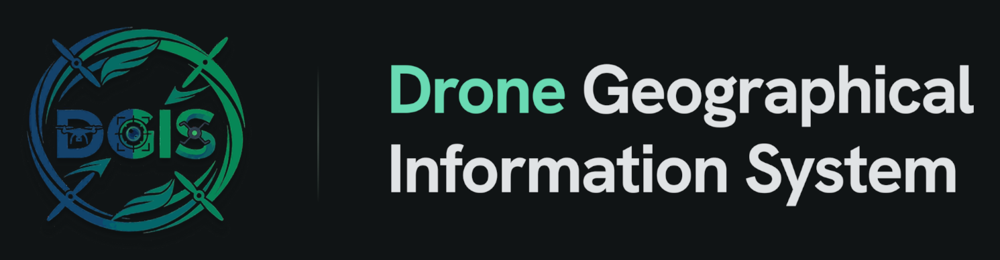
</p>

<p align="center">
  
  
</p>

**An end-to-end autonomous wildlife survey platform** combining drone simulation, on-device machine learning, a quadruped robot with edge AI, and a data analysis dashboard — built as a graduation project demonstrating the intersection of robotics, computer vision, IoT, and geographic information systems.

---

## 🧩 System Overview

DGIS is a multi-component system that autonomously explores diverse biome terrains to detect, classify, and catalog animal species. The platform spans from a Unity-based drone simulation all the way to a physical quadruped robot with real-time object detection, connected through MQTT, and analyzed via a web dashboard.

```
┌──────────────────────────────────────────────────────────────────────┐
│                         DGIS — Full System                           │
│                                                                      │
│  ┌──────────────┐   ONNX model    ┌──────────────┐                   │
│  │  ML Models   │ ──────────────► │  Simulation  │                   │
│  │  (YOLOv26s)  │                 │  (Unity 6)   │                   │
│  │              │  TFLite model   │              │                   │
│  │  train_real  │ ──────┐         │  Drones +    │                   │
│  │  train_sim   │       │         │  LiDAR +     │                   │
│  └──────────────┘       │         │  A* + SQLite │                   │
│                         │         └──────┬───────┘                   │
│                         │               │                            │
│                         ▼               │  .db files                 │
│                  ┌──────────────┐       │                            │
│                  │  Mobile App  │       ▼                            │
│                  │  (Android)   │  ┌──────────────┐                  │
│                  │  YOLO+Depth  │  │  Dashboard   │                  │
│                  │  + USB→ESP32 │  │  (React+Vite)│                  │
│                  └──────┬───────┘  │  + Express   │                  │
│                         │          │  + SQLite    │                  │
│                    USB Serial      └──────────────┘                  │
│                         │                                            │
│                         ▼                                            │
│                  ┌──────────────┐                                    │
│                  │  IoT Robot   │                                    │
│                  │  (ESP32 +    │                                    │
│                  │  12 servos + │                                    │
│                  │  Bluepad32)  │                                    │
│                  └──────────────┘                                    │
└──────────────────────────────────────────────────────────────────────┘
```

---

## 📂 Repository Structure

This project is organized into **5 repositories**, each handling a distinct part of the system. They're linked here as git submodules for easy navigation, but each one is fully independent — clone only what you need.

| Repository | Description | Tech Stack |
|---|---|---|
| [`dgis-simulation/`](dgis-simulation/) | Autonomous drone simulation with YOLO detection, LiDAR, A* pathfinding, and SQLite logging | Unity 6, C#, Sentis, YOLOv26s ONNX |
| [`dgis-ml-models/`](dgis-ml-models/) | YOLO model training for both simulation and real-world deployment | Python, Ultralytics, PyTorch, ONNX, TFLite |
| [`dgis-mobile/`](dgis-mobile/) | Android edge-AI app — live YOLO detection + depth estimation + USB serial bridge | Kotlin, TFLite, ONNX Runtime, CameraX |
| [`dgis-iot/`](dgis-iot/) | Quadruped robot — ESP32 firmware, control station GUI, CAD, and Arduino sketches | C++, PlatformIO, Python/Tkinter, MQTT |
| [`dgis-analysis-dashboard/`](dgis-analysis-dashboard/) | Web dashboard for viewing and filtering ecological detections across biomes | React, TypeScript, Vite, Express, SQLite |

### Cloning a single component

Each repo works completely standalone — you don't need to pull down the whole system to work on one piece:

```bash
git clone https://github.com/AhmedMohamady1/dgis-simulation.git
git clone https://github.com/AhmedMohamady1/dgis-ml-models.git
git clone https://github.com/OmarEhab76/DGIS-Analysis-Dashboard.git
git clone https://github.com/mohammed-mahmoud101/dgis-iot.git
git clone https://github.com/Al-HusainYaser/dgis-mobile.git
```

---

## 🔄 How the Components Connect

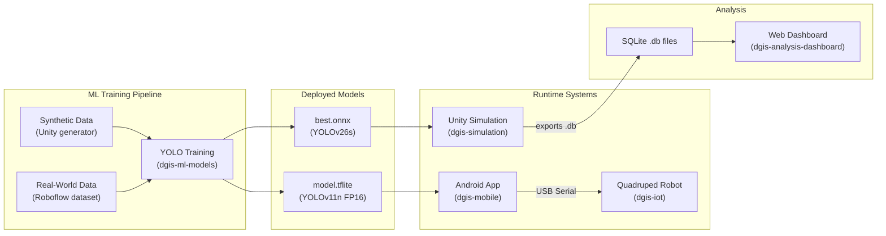

### Data & Model Flow

1. **Training** — `dgis-ml-models` trains two YOLO variants:
   - **Sim model** (`.onnx`, YOLOv26s) — trained on synthetic images from the Unity data generation pipeline, consumed by the simulation
   - **Mobile model** (`.tflite`, YOLOv11n) — trained on real-world images and exported in a lighter, faster variant suited for on-device inference on the Android app

2. **Simulation** — `dgis-simulation` runs autonomous drone missions in Unity across 5 biome environments, using YOLOv26s + simulated LiDAR + A* pathfinding to detect and catalog animal species into a SQLite database

3. **Mobile Edge AI** — `dgis-mobile` runs live YOLOv11/v26 object detection and Depth Anything V2 monocular depth estimation on-device, sending hazard analysis and detection data over USB serial to the robot

4. **Quadruped Robot** — `dgis-iot` receives commands via MQTT (from the control station) and USB serial (from the phone), controlling 12 servos through a PCA9685 driver. A Bluetooth gamepad can also control the robot directly via Bluepad32

5. **Dashboard** — `dgis-analysis-dashboard` ingests the SQLite databases exported by the simulation and presents detection data, species distributions, and biome statistics through an interactive React web interface

---

## 🌍 Supported Biomes

The system supports **5 distinct biome environments**, each with region-appropriate wildlife:

| Biome | Species (examples) |
|---|---|
| **Temperate Forest** | American Black Bear, Raccoon, Red Fox, White-tailed Deer, Wood Frog |
| **Boreal Forest** | Beaver, Lynx, Marten, Squirrel, Warbler, Woodpecker |
| **Mountain** | Alpine Marmot, Elk, Golden Eagle, Grizzly Bear, Mountain Lion |
| **Plains** | Bison, Hyena, Lion, Elephant, Quail, Zebra, Black-footed Ferret |
| **Subtropical Desert** | Desert Scorpion, Dromedary Camel, Fennec Fox, Gecko, Horned Lizard, Jerboa |

---

## 🚀 Quick Start

Each component runs independently. Click through to the individual README for full setup instructions.

### 1. Simulation — `dgis-simulation/`

> **Easiest option:** [Download the pre-built release](https://drive.google.com/file/d/1lrsF7mC_t7-3AG-MFD2wHoMBRn6z8Fq2/view?usp=sharing) (Windows 64-bit, no dependencies).

For source: Requires **Unity 6** (6000.2.6f2) + third-party environment assets from the Unity Asset Store. See [dgis-simulation/README.md](dgis-simulation/README.md) for the full asset list.

### 2. ML Models — `dgis-ml-models/`

```bash
cd dgis-ml-models
python -m venv yolo_env && yolo_env\Scripts\activate
pip install -r requirements.txt

# Train simulation model
python scripts/train_unity.py

# Train mobile model
python scripts/train_real.py
```

See [dgis-ml-models/README.md](dgis-ml-models/README.md) for GPU setup and dataset details.

### 3. Mobile App — `dgis-mobile/`

Open in **Android Studio**, sync Gradle, and deploy:

```bash
cd dgis-mobile
./gradlew installDebug
```

Requires ML model assets in `app/src/main/assets/`. See [dgis-mobile/README.md](dgis-mobile/README.md).

### 4. IoT / Quadruped Robot — `dgis-iot/`

<p align="center">
  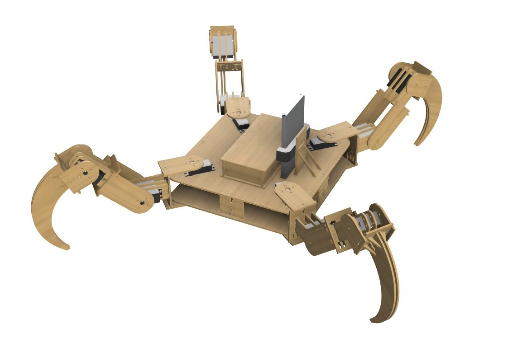
  &nbsp;&nbsp;
  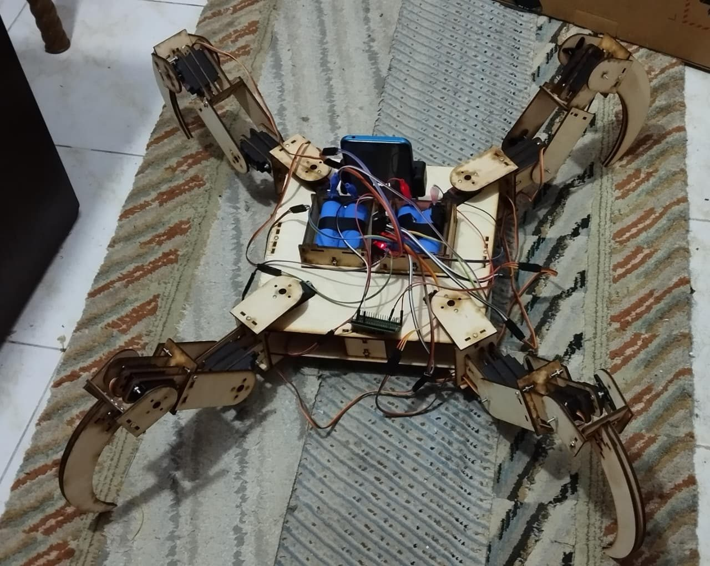
</p>

**Firmware** (PlatformIO):
```bash
cd dgis-iot/esp32-firmware
# Edit src/main.cpp with your WiFi credentials
pio run -t upload
```

**Control Station** (Python):
```bash
cd dgis-iot/control-station
pip install -r requirements.txt
python s7s_control_station.py
```

See [dgis-iot/README.md](dgis-iot/README.md) for the full MQTT topic reference, joint map, and CAD details.

### 5. Analysis Dashboard — `dgis-analysis-dashboard/`

```bash
cd dgis-analysis-dashboard
npm install
npm run dev
```

Opens at [http://localhost:8080](http://localhost:8080) (frontend) and [http://localhost:3001](http://localhost:3001) (API). Requires the SQLite `.db` files from simulation runs. See [dgis-analysis-dashboard/README.md](dgis-analysis-dashboard/README.md).

---

## 🛠️ Technology Stack

| Layer | Technologies |
|---|---|
| **Simulation** | Unity 6, C#, URP, Sentis, SQLite-net, A* Pathfinding |
| **Machine Learning** | Python, Ultralytics YOLO, PyTorch, ONNX, TensorFlow Lite |
| **Mobile** | Kotlin, Android CameraX, TFLite, ONNX Runtime, Depth Anything V2 |
| **IoT / Robotics** | ESP32, PlatformIO, Bluepad32, PCA9685, MQTT, Arduino |
| **Desktop Control** | Python, Tkinter, paho-mqtt, matplotlib |
| **Web Dashboard** | React, TypeScript, Vite, Tailwind CSS, shadcn/ui, Express, SQLite |
| **CAD / Mechanical** | FreeCAD, DXF (laser cutting) |

---

## 📸 Screenshots

<details>
<summary><strong>Simulation — Autonomous Drone Exploration</strong></summary>

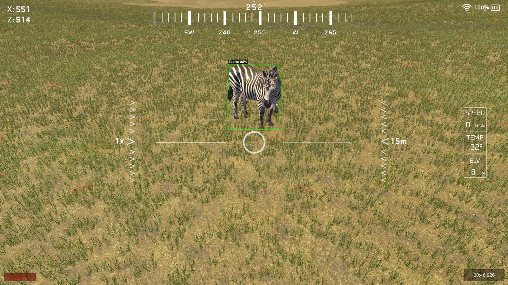
*Drone HUD with real-time YOLOv26s zebra detection*

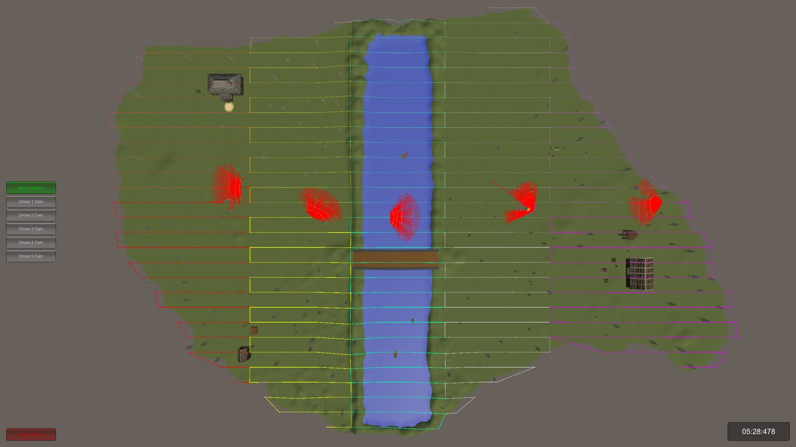
*Top-down mission view — multi-drone terrain exploration*

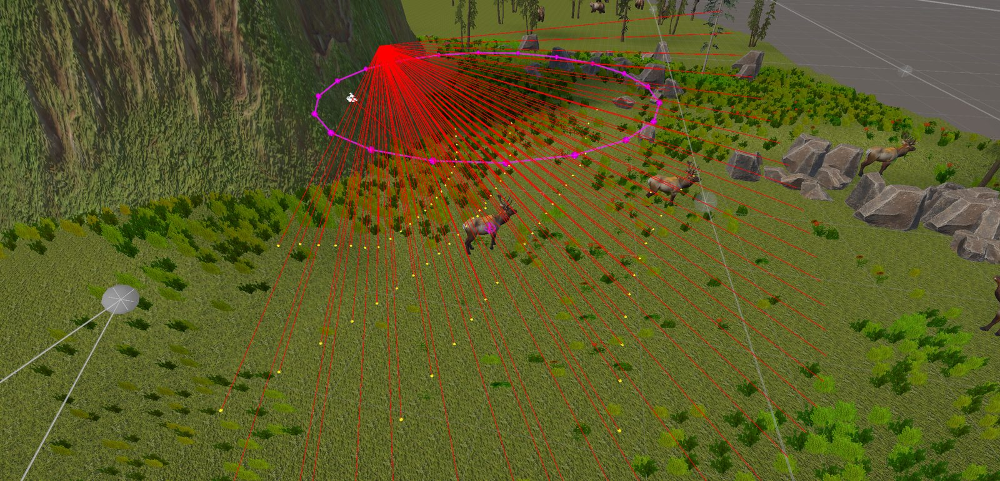
*Two-pass orbit around a detected animal*

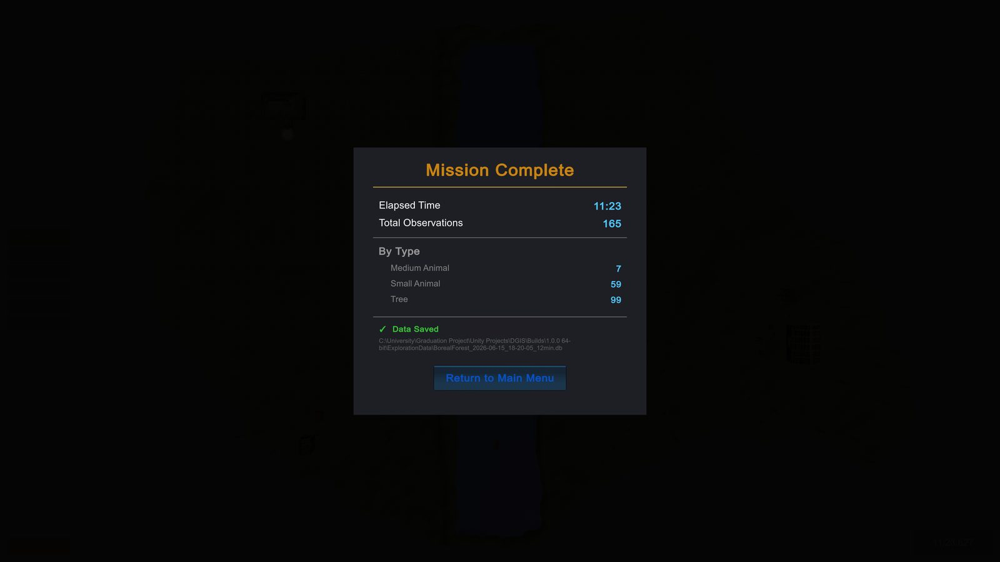
*Post-mission results summary*

</details>

<details>
<summary><strong>ML Models — YOLO Detections</strong></summary>

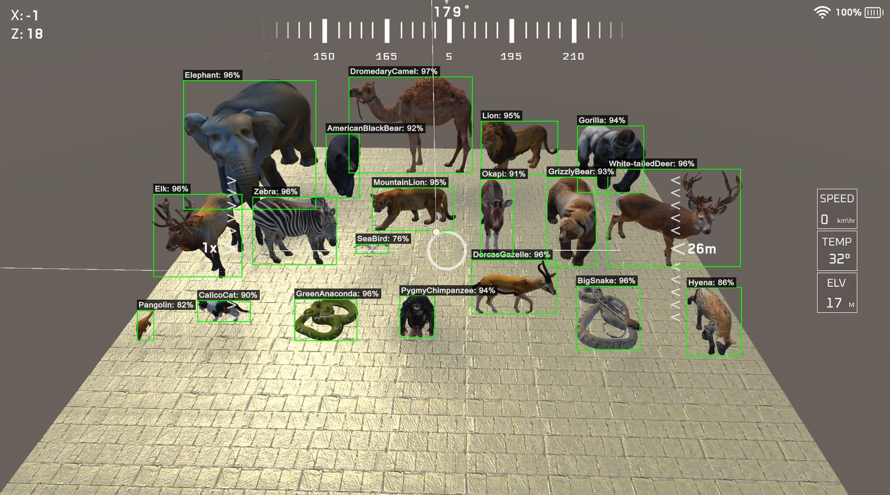
*Simulation YOLO detections (synthetic data)*

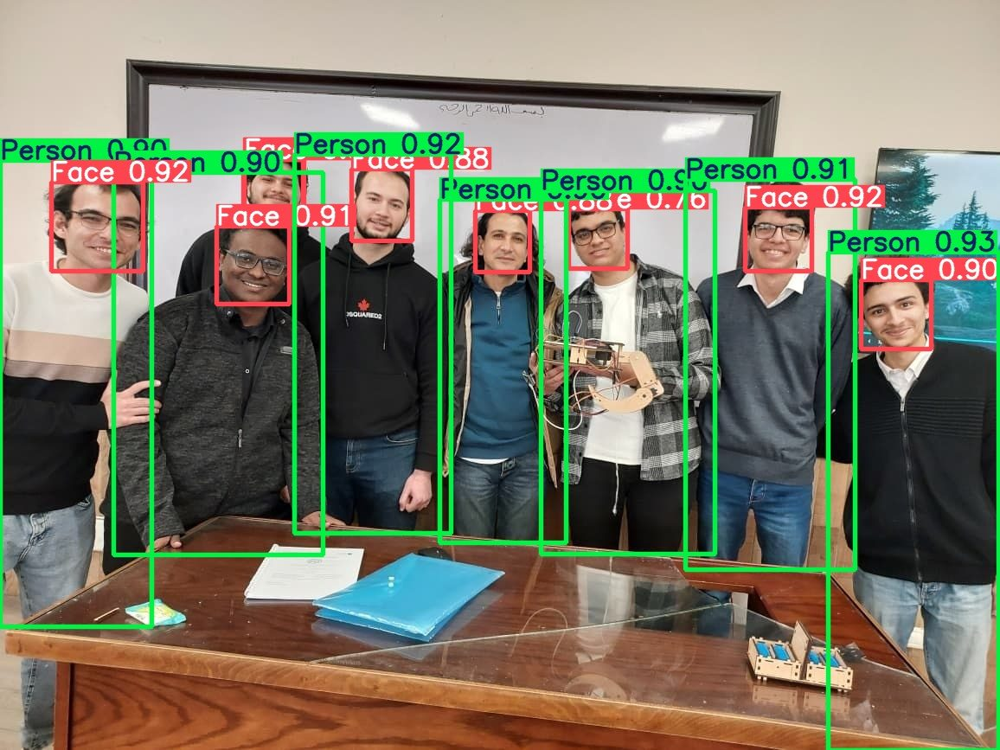
*Real-world YOLO detections (mobile model)*

</details>

<details>
<summary><strong>IoT — Quadruped Robot</strong></summary>

<p align="center">
  
  &nbsp;&nbsp;
  
</p>

*Left: FreeCAD 3D render — Right: Assembled quadruped with ESP32, PCA9685, and 12 servos*

</details>

---

## 👥 Team

**Faculty of Computing and Data Sciences — Alexandria University**
Graduation Project · 2025/2026

<p align="center">
  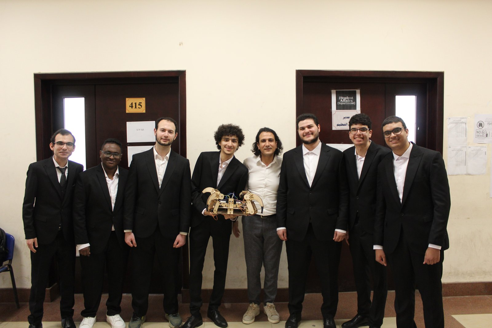
</p>

<table>
  <tr>
    <td align="center" width="150px">
      <a href="https://github.com/AhmedMohamady1">
        
        <br />
        <sub><b>Ahmed Mohamady</b></sub>
      </a>
    </td>
    <td>
      Drone Navigation & Exploration · Simulation Environments · Image Generation · Image Recognition · Database Design · Analysis Dashboard (Design) · Simulation Program UI
    </td>
  </tr>
  <tr>
    <td align="center" width="150px">
      <a href="https://github.com/fares187">
        
        <br />
        <sub><b>Fares Ahmed</b></sub>
      </a>
    </td>
    <td>
      Drone Navigation & Exploration · Simulation Environments · Image Generation · Quadruped Robot Movement · Quadruped Robot Design
    </td>
  </tr>
  <tr>
    <td align="center" width="150px">
      <a href="https://github.com/mohammed-mahmoud101">
        
        <br />
        <sub><b>Mohamed Mahmoud</b></sub>
      </a>
    </td>
    <td>
      Quadruped Robot Design · Quadruped Robot Assembly · Electrical Circuitry & Hardware Integration
    </td>
  </tr>
  <tr>
    <td align="center" width="150px">
      <a href="https://github.com/Al-HusainYaser">
        
        <br />
        <sub><b>Al-Husain Yaser</b></sub>
      </a>
    </td>
    <td>
      Electrical Circuitry & Hardware Integration · Mobile Application · Simulation Program UI
    </td>
  </tr>
  <tr>
    <td align="center" width="150px">
      <a href="https://github.com/omarhafez66">
        
        <br />
        <sub><b>Omar Hafez</b></sub>
      </a>
    </td>
    <td>
      Image Recognition · Database Design · Analysis Dashboard (Design) · Simulation Program UI
    </td>
  </tr>
  <tr>
    <td align="center" width="150px">
      <a href="https://github.com/OmarEhab76">
        
        <br />
        <sub><b>Omar Ehab</b></sub>
      </a>
    </td>
    <td>
      Drone Navigation & Exploration · Simulation Environments · Database Design · Analysis Dashboard (Implementation)
    </td>
  </tr>
  <tr>
    <td align="center" width="150px">
      <a href="https://github.com/Ahmed-Emad-Ds">
        
        <br />
        <sub><b>Ahmed Emad</b></sub>
      </a>
    </td>
    <td>
      Drone Navigation & Exploration · Database Design · Simulation Results Analysis
    </td>
  </tr>
</table>

**Supervisor:** Dr. Mahmoud Gamal

---

## 📄 Individual READMEs

For detailed setup, architecture, and API references, see each component's README:

- [dgis-simulation/README.md]([dgis-simulation/README.md](https://github.com/AhmedMohamady1/dgis-simulation/tree/05ecf8f14dad702ee0ef71b620f8bc1ec9edd5ab)) — Simulation architecture, biome details, core scripts reference, database schema
- [dgis-ml-models/README.md]([dgis-ml-models/README.md](https://github.com/AhmedMohamady1/dgis-ml-models/blob/2d85e91700e21781db6269a7a67d0bd6f6d4e602/README.md)) — Training pipeline, datasets, export formats, evaluation results
- [dgis-mobile/README.md]([dgis-mobile/README.md](https://github.com/Al-HusainYaser/dgis-mobile/tree/e060d0d32a8e5c1c0dc3d442a6600f342261ebff)) — Android app features, model requirements, USB serial protocol
- [dgis-iot/README.md]([dgis-iot/README.md](https://github.com/mohammed-mahmoud101/dgis-iot/tree/883c5186122adcb371782bfa7da3cd8bb88b1c30)) — MQTT topics, joint map, gait commands, CAD assemblies, control station tabs
- [dgis-analysis-dashboard/README.md]([dgis-analysis-dashboard/README.md](https://github.com/OmarEhab76/DGIS-Analysis-Dashboard/blob/9da781a3a1c8b6bf76c5dbefa37bb77481fad5bd/README.md)) — Dashboard setup, biome database mapping, API endpoints

---

## 📃 License

MIT — see [LICENSE](LICENSE) for details.
